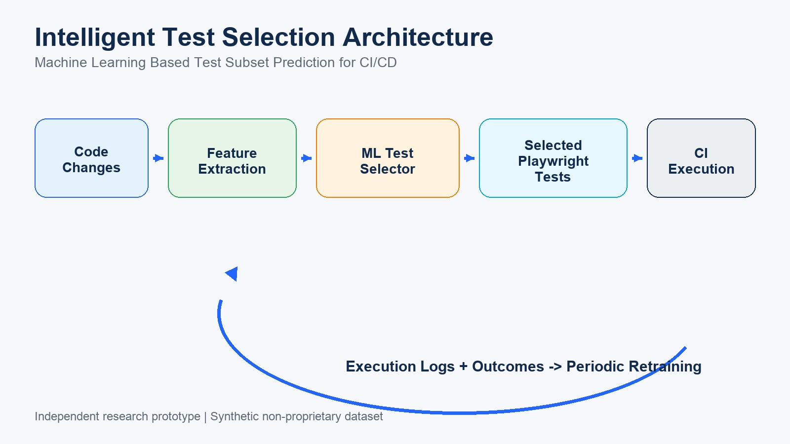
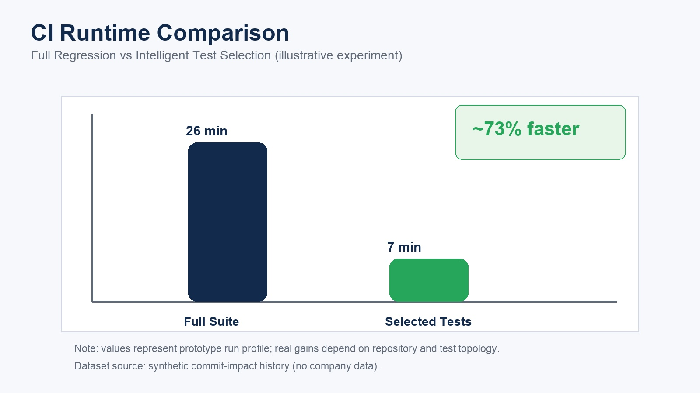

# Machine Learning Based Intelligent Test Selection for Faster CI/CD Pipelines

A reproducible prototype that uses machine learning to predict which Playwright tests should run for a given code change.


---

## Problem

Large regression suites make CI/CD pipelines slower and more expensive. Teams often run all tests for every commit, even when only a small subset is impacted.

## Solution

Train a machine learning model on historical commit-to-test-impact data. For every new commit, predict only impacted tests and run those first.

Example:

- Commit touches `src/services/inventory.js`
- Model selects:
  - `tests/playwright/tests/inventory.spec.js`
  - `tests/playwright/tests/order.spec.js`

Expected outcome: 70-80% faster feedback loops in many repositories (depends on historical data quality and fallback policies).

---

## Research Disclosure

- This repository is an independent research-style engineering study by the author.
- It is not based on any proprietary company dataset.
- The current dataset is synthetic and generated locally for reproducible experimentation.
- It should be treated as a prototype baseline, not a peer-reviewed publication.

---

## Architecture

Code Change -> Feature Extraction -> ML Selector -> Test Subset -> Playwright Run -> Feedback Logs -> Retraining

See [docs/architecture.md](docs/architecture.md).




---

## Project Structure

```text
intelligent-test-selection-ml/
├── ci/
│   └── select_tests.py
├── data/
│   └── processed/
│       └── synthetic_commit_history.csv
├── docs/
│   └── architecture.md
├── ml/
│   ├── generate_synthetic_history.py
│   ├── train_selector.py
│   └── predict_tests.py
├── posts/
│   ├── devto-intelligent-test-selection.md
│   └── linkedin-intelligent-test-selection.md
├── src/
│   └── services/
│       ├── inventory.js
│       ├── order.js
│       └── payment.js
├── tests/
│   └── playwright/
│       ├── playwright.config.js
│       └── tests/
│           ├── inventory.spec.js
│           ├── order.spec.js
│           └── payment.spec.js
├── .github/workflows/
│   └── intelligent-test-selection.yml
├── package.json
├── requirements.txt
└── README.md
```

---

## Quick Start

### 1. Clone

```bash
git clone https://github.com/srivastava-rajeev/intelligent-test-selection-ml.git
cd intelligent-test-selection-ml
```

### 2. Python setup

```bash
python3 -m venv .venv
source .venv/bin/activate
pip install -r requirements.txt
```

### 3. Train selector model

```bash
python3 ml/generate_synthetic_history.py
python3 ml/train_selector.py
```

### 4. Predict tests for a commit

```bash
python3 ci/select_tests.py \
  --changed-files src/services/inventory.js src/services/order.js
```

### 5. Run selected Playwright tests

```bash
npm install
npx playwright install
SELECTED_TESTS="tests/playwright/tests/inventory.spec.js,tests/playwright/tests/order.spec.js" npm run test:selected
```

---

## CI Integration Strategy

1. Detect changed files from git diff.
2. Run `ci/select_tests.py` to choose impacted tests.
3. Execute selected tests first.
4. Optionally run full suite as nightly safety net.
5. Continuously retrain using latest CI outcomes.

---

## Content Assets

- Live Dev.to post: [Machine Learning Based Intelligent Test Selection for Faster CI/CD Pipelines](https://dev.to/rajeevsrivastava/machine-learning-based-intelligent-test-selection-for-faster-cicd-pipelines-2ela)
- Live LinkedIn post: [LinkedIn activity post](https://www.linkedin.com/feed/update/urn:li:activity:7436561473549701122/)

---

## Cross-Repo Validation

This repository includes `.github/workflows/cross-validation.yml` to run lightweight smoke checks against:

- this repo (`intelligent-test-selection-ml`)
- peer repo (`flaky-test-prediction-ml`)

For new repositories, copy these workflow files before first PR merge:

- `.github/workflows/quality-gate.yml`
- `.github/workflows/codeql.yml`
- `.github/workflows/dependency-review.yml`
- `.github/workflows/cross-validation.yml`

---

## License

MIT
